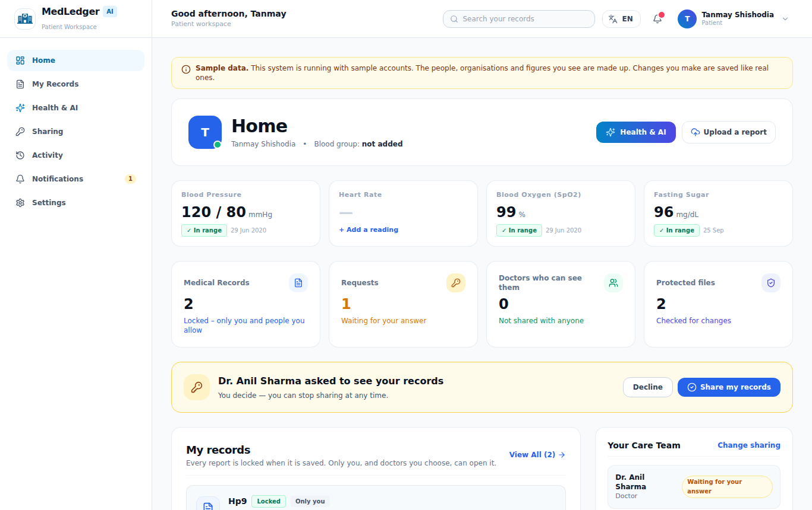
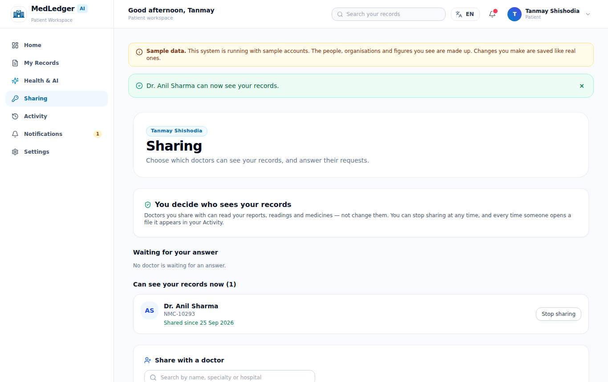
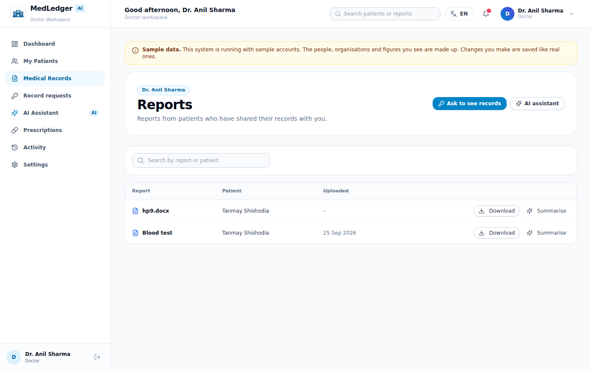
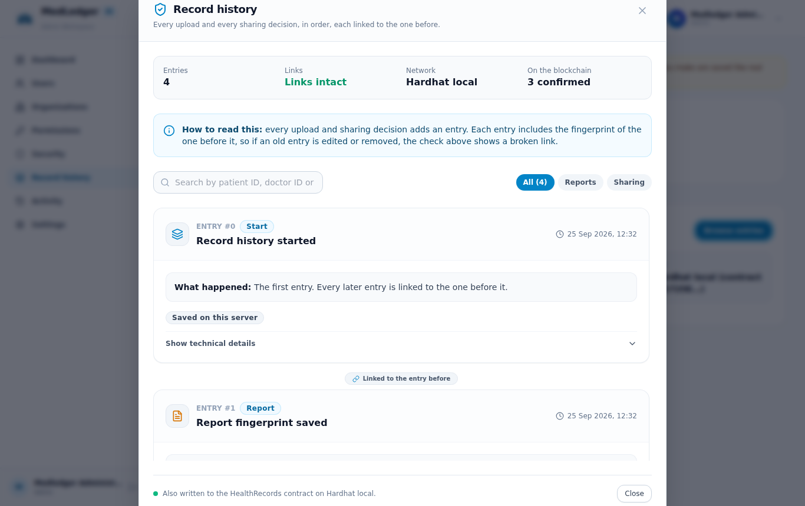
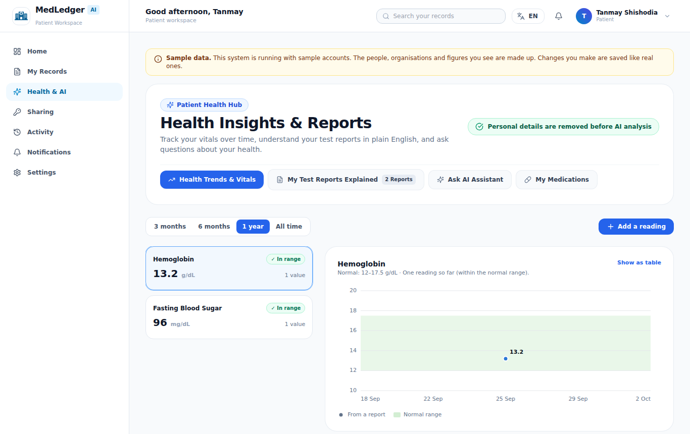
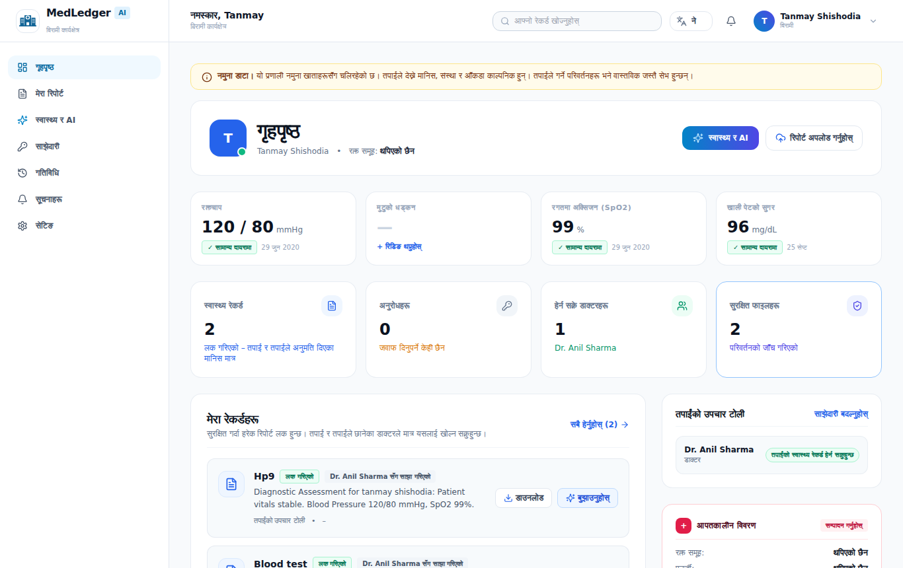
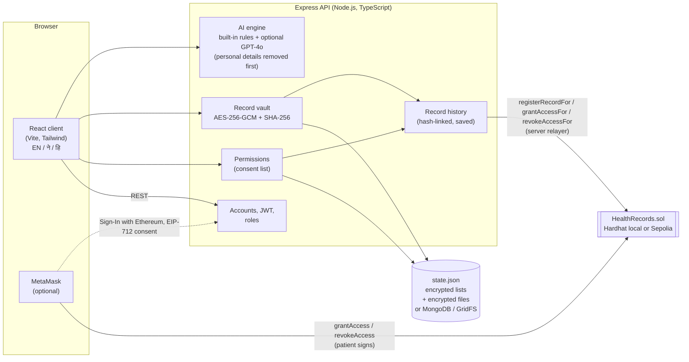

# MedLedger AI

**Health records that patients control.** MedLedger AI keeps medical reports from hospitals, clinics and labs in one place. Every file is locked (AES-256-GCM) before it is stored. The patient decides which doctors can open it. Each upload and each sharing decision is written to a record history that can be checked, and optionally to an Ethereum smart contract. A built-in AI assistant explains reports in plain words, charts readings over time and flags medicines that may not mix.

It has workspaces for **patients, doctors, hospitals, diagnostic labs, insurers and system administrators**. It works in **English, नेपाली and हिन्दी**, and on phones.

| Patient home | Sharing with a doctor |
|---|---|
|  |  |
| **Doctor: records patients shared** | **Admin: record history on Ethereum** |
|  |  |
| **Readings over time** | **In Nepali** |
|  |  |

---

## Contents

1. [What it does](#what-it-does)
2. [How it fits together](#how-it-fits-together)
3. [Quick start](#quick-start)
4. [Demo accounts](#demo-accounts)
5. [Blockchain: local chain and Sepolia](#blockchain-local-chain-and-sepolia)
6. [Settings (environment variables)](#settings-environment-variables)
7. [Tests](#tests)
8. [Project layout](#project-layout)
9. [API overview](#api-overview)
10. [Security notes and deployment](#security-notes-and-deployment)

---

## What it does

**Patients**
- Upload reports as PDF, Word or photo files. Scanned pages are read with OCR on the server, so nothing is sent out.
- Decide who can see their records: answer doctors' requests, share with a doctor found by search, and stop sharing at any time. They can also confirm each change in MetaMask.
- See every upload, share and file opening in their Activity, written as sentences, for example "Dr. Anil Sharma opened your Blood test".
- Get plain-language report explanations, charts of blood pressure, sugar and other readings, and warnings about medicine interactions.
- Check that a file is unchanged since upload.

**Doctors**
- Ask patients for access, open the records patients share, write prescriptions and notes.
- Get AI help with chart summaries, lab triage, drug interactions and SOAP notes. Personal details are removed before any text reaches an external AI.

**Hospitals, labs and insurers**
- Hospitals manage staff, admissions and prescriptions.
- Labs track samples, upload results and check that a report is unchanged.
- Insurers review claims using documents that patients chose to attach.

**Administrators**
- Manage accounts and organisations.
- See real sign-in and security figures.
- Browse the whole record history, with a link check and each entry's Ethereum transaction.

**Protections**
- **Files:** every file has its own AES-256-GCM key, and that key is wrapped by a master key. The SHA-256 fingerprint of the original is kept and checked whenever the file is opened. If one byte of the stored file changes, the download is refused and the change is logged.
- **Stored lists:** lists that hold personal data (readings, chats, prescriptions, claims and similar) are stored encrypted.
- **Accounts:** passwords use bcrypt. Too many wrong passwords lock the account, and sign-in requests are rate-limited. Sessions can be ended one by one.
- **Access:** every request is checked by role, and doctors can only open records a patient has shared with them.

---

## How it fits together



**Who can see a record** is decided in one place: the permission list, kept per patient and per doctor. The dashboard counts, record lists, downloads and notifications all read that list.

**The record history** is a list where each entry includes the hash of the one before it. It is saved with the server state, so it survives restarts, and any edit to an old entry breaks the links after it. When a contract is set up, each entry is also sent to Ethereum in the background:

- **An upload** is sent as `registerRecordFor(patient, fingerprint)`.
- **Sharing** is sent as `grantAccessFor(patient, doctor)`.
- **Stopping sharing** is sent as `revokeAccessFor(patient, doctor)`.
- **A change the patient confirmed in MetaMask** was already sent by the patient's own wallet as `grantAccess` or `revokeAccess`. MedLedger records that transaction instead of sending a second one.

Only fingerprints and pseudonymous addresses go on the chain, never medical content or names.

---

## Quick start

You need **Node.js 20 or newer** and npm. MongoDB is optional; without it everything is stored in `apps/server/state.json` and an encrypted-files folder.

```bash
git clone <this repository>
cd AI-Blockchain-Electronic-Health-Records-Management-System
npm run install:all                     # root (contract tools) + apps/server + apps/client

cp apps/server/.env.example apps/server/.env
cp apps/client/.env.example apps/client/.env
# In apps/server/.env, set JWT_SECRET to a long random value:
#   node -e "console.log(require('crypto').randomBytes(48).toString('hex'))"

npm run dev:server                      # API on http://localhost:8080
npm run dev:client                      # app on http://localhost:8081 (second terminal)
```

Open http://localhost:8081 and choose **Try a demo** on the sign-in page.

- **Master key.** In development the server creates `apps/server/.medledger-master.key` on first start. Back it up: without it, stored files cannot be opened. In production, set `MASTER_ENCRYPTION_KEY` instead.
- **AI.** Without `OPENAI_API_KEY` the built-in engine is used and no data leaves the server.

---

## Demo accounts

These accounts are created while `DEMO_ACCOUNTS=true` (the default outside production). A yellow banner marks sample data.

| Role | Email | Password |
|---|---|---|
| Patient | patient@medledger.demo | secret99 |
| Doctor | doctor@medledger.demo | secret99 |
| Hospital | hospital@medledger.demo | hospital123 |
| Lab | lab@medledger.demo | lab123 |
| Insurance | insurance@medledger.demo | insurance123 |
| Administrator | admin@medledger.demo | admin123 |

---

## Blockchain: local chain and Sepolia

The app works with no chain at all: the record history is then kept on the server only, and the admin page says so. To also write the history to the `HealthRecords` contract, use either a local chain or Sepolia.

**Local chain (no real ETH needed)**

```bash
npm run chain:node          # terminal 1: Hardhat node on http://127.0.0.1:8545
npm run deploy:local        # terminal 2: deploys and fills in apps/server/.env
npm run dev:server          # restart the API; it logs "[Ledger] Writing to the HealthRecords contract …"
# use the app (upload, share, stop sharing), then:
npm run chain:events:local  # lists RecordAdded / AccessGranted / AccessRevoked events
```

For MetaMask on the local chain, add network `http://127.0.0.1:8545` with chain ID 31337, and import one of the test accounts that `chain:node` prints.

**Sepolia test network**

1. Create a new wallet account for the server. Get a little Sepolia ETH from a faucet, and an RPC URL from Alchemy or Infura.
2. In the root `.env`, set `SEPOLIA_RPC_URL` and `SEPOLIA_PRIVATE_KEY` for that account. See `.env.example`.
3. Run `npm run deploy:sepolia`. This prints the contract address and its Etherscan link, writes `blockchain/deployments/sepolia.json`, and sets `HEALTH_RECORDS_CONTRACT_ADDRESS` and `WALLET_CHAIN_ID=11155111` in `apps/server/.env`.
4. In `apps/server/.env`, set `CHAIN_RPC_URL` (the same RPC URL) and `CHAIN_PRIVATE_KEY` (the same account). The deploying account is the contract's **relayer**, the only account allowed to call the `…For` functions. It can be handed over with `setRelayer`.
5. Restart the server. Share and then stop sharing as a patient. Then run `npm run chain:events:sepolia`, or open **Admin → Record history**, where each entry links to its transaction on sepolia.etherscan.io.

Transactions are sent one at a time in the background, so pages never wait for the network. Anything not yet sent when the server stops is sent after the next start. Failures are shown on the admin page.

**The contract** (`blockchain/contracts/HealthRecords.sol`, Solidity 0.8.20)

| Function | Who calls it |
|---|---|
| `registerRecord(bytes32)`, `grantAccess(address)`, `revokeAccess(address)` | the patient's own wallet (MetaMask) |
| `registerRecordFor(address,bytes32)`, `grantAccessFor(address,address)`, `revokeAccessFor(address,address)` | the MedLedger relayer, for patients without a wallet |
| `hasAccess`, `verifyRecord`, `getRecordDetails`, `getPatientRecords` | read-only checks |
| `logAccess(address,string)`, `setRelayer(address)` | audit note; hand over the relayer role |

Events: `RecordAdded`, `AccessGranted`, `AccessRevoked`, `AccessLogged`, `RelayerChanged`.

---

## Settings (environment variables)

These go in `apps/server/.env`; `.env.example` explains every line. The most important:

| Variable | What it does |
|---|---|
| `JWT_SECRET` | Signs sign-in tokens. **Required** in production (32+ random characters). |
| `MASTER_ENCRYPTION_KEY` | 64 hex characters that protect every file key. **Required** in production. **Back it up.** |
| `MASTER_ENCRYPTION_KEYS_PREVIOUS` | Old master keys during a rotation (`npm run keys:rotate` in apps/server). |
| `MONGODB_URI`, `FILE_STORAGE_BACKEND` | Use MongoDB + GridFS (`gridfs`), local files (`local`) or whichever is available (`auto`). |
| `STATE_FILE_PATH` | Where the JSON state (with encrypted lists) is kept. |
| `CLIENT_ORIGINS`, `CLIENT_URL` | Front-end addresses allowed to call the API. |
| `DEMO_ACCOUNTS`, `EXPOSE_RESET_TOKEN` | Demo accounts and showing reset links in the page. **Set both to `false` in production.** |
| `AUTH_RATE_LIMIT`, `MAX_FAILED_LOGINS`, `LOCKOUT_MINUTES`, `BCRYPT_ROUNDS` | Sign-in protection. |
| `OPENAI_API_KEY`, `OPENAI_MODEL`, `AI_TIMEOUT_MS` | Optional external AI. Only text with personal details removed is sent. |
| `OCR_ENABLED`, `OCR_LANGUAGES` | Reading scanned files (`eng`, or `eng+nep`). |
| `WALLET_CHAIN_ID` | 11155111 (Sepolia) or 31337 (local). |
| `HEALTH_RECORDS_CONTRACT_ADDRESS`, `CHAIN_RPC_URL`, `CHAIN_PRIVATE_KEY` | Write the record history to the contract (all three needed). |
| `BLOCKCHAIN_MODE` | `auto` (default) or `simulated` (never write to a chain). |

The client has one setting, `VITE_API_URL` in `apps/client/.env`, which is the API address.

---

## Tests

```bash
npm test            # contract (Hardhat) + server (node:test) + client (Vitest)
npm run test:e2e    # browser tests (Playwright); first time: cd apps/client && npx playwright install chromium
```

| Suite | Where | What it covers |
|---|---|---|
| Contract, 18 tests | `blockchain/test/HealthRecords.test.js` | Records, sharing, tamper checks, audit events, relayer-only functions |
| Server, 171 tests | `apps/server/tests/*.test.ts` | Accounts, lockout, sessions, AI and de-identification, encryption and tamper detection, OCR, trends, MetaMask sign-in and consent, the Phase 1–3 APIs, the record history. `chain.test.ts` starts a Hardhat node, deploys the contract and checks that uploads and sharing become confirmed transactions. |
| Client, 22 tests | `apps/client/src/__tests__` | Registration form, password rules, the trend chart, the MetaMask flow (mocked wallet), friendly error messages, dates, Nepali and Hindi switching |
| Browser, 23 tests | `apps/client/e2e` | Patient uploads → shares → doctor opens → lab checks the fingerprint → admin sees the history → patient stops sharing → doctor loses access. Every page of every role opens; roles cannot open each other's pages; languages; phone layout. |

Two more checks are in `docs/ui-audit`:

- `plain-language-audit.js` scores every page for jargon. All 56 pages score 9.7 or higher out of 10.
- `translation-coverage.js` lists any app text still in English on the Nepali or Hindi pages.

---

## Project layout

```
apps/
  client/            React + TypeScript app (Vite, Tailwind, zustand)
    src/features/    one folder per workspace (patient, doctor, hospital, laboratory, insurance, admin, ai, …)
    src/i18n/        language switcher and Nepali / Hindi texts
    e2e/             Playwright tests
    scripts/         i18n-missing.cjs lists new text that needs translating
  server/            Express + TypeScript API
    src/services/    recordVault (encryption), consentService, blockchainService (record history + contract),
                     aiService, deidentify, textExtraction (PDF/OCR), walletService (MetaMask), …
    tests/           node:test suites
blockchain/
  contracts/         HealthRecords.sol
  scripts/           deploy.js, events.js
  test/              contract tests
docs/
  screenshots/       images used in this README
  ui-audit/          plain-language and translation checks with their results
  DEPLOYMENT.md      production checklist
  PAPER-UPDATES.md   updated System and Results text for the paper
legacy/              the original Vue 2 app and backend, kept for reference (not used)
```

---

## API overview

Every route except sign-in, registration, the public fingerprint check and `/health` needs `Authorization: Bearer <token>`.

| Area | Routes |
|---|---|
| Accounts | `POST /api/auth/register · login · logout · logout-others · change-password · forgot-password · reset-password · demo`, `GET /api/auth/profile · sessions` |
| Records | `POST /api/records/upload`, `GET /api/records`, `GET /api/records/:id/download · verify · text`, `POST /api/records/:id/extract`, `GET /api/summary` (dashboard counts) |
| Sharing | `GET /api/access/status · doctors`, `POST /api/access/request · grant · decline · revoke` |
| MetaMask | `GET /api/wallet/config`, `POST /api/wallet/link/challenge · link · consent/prepare · consent · consent/tx`, `POST /api/auth/wallet/challenge · login` |
| AI | `POST /api/ai/summarize · analyze · trends · chat · drug · risk · deidentify`, `POST /api/ai/doctor/chart-synthesis · drug-interactions · lab-triage · soap-note` |
| Readings, prescriptions | `/api/vitals`, `/api/prescriptions` |
| Organisations | `/api/staff`, `/api/admissions`, `/api/samples`, `/api/claims`, `/api/policyholders`, `/api/organisations` |
| Record history | `POST /api/blockchain/verify` (anyone), `GET /api/blockchain/blocks · status` (administrators) |
| Admin | `GET /api/admin/stats · security · users · audit`, `POST /api/admin/users`, `PATCH /api/admin/users/:userId/status` |

---

## Security notes and deployment

Before running MedLedger with real patients, work through [docs/DEPLOYMENT.md](docs/DEPLOYMENT.md). It covers master key backup, the production `.env`, MongoDB with GridFS, HTTPS, CORS, rate limits, turning demo mode off, and the relayer key.

This is a research prototype and has not been certified for clinical use. The AI output is information to discuss with a doctor, not a diagnosis.

---

*The original Vue 2 version and its demo recordings are kept in `legacy/` and `docs/gif/`.*
# MedLedger-AI

